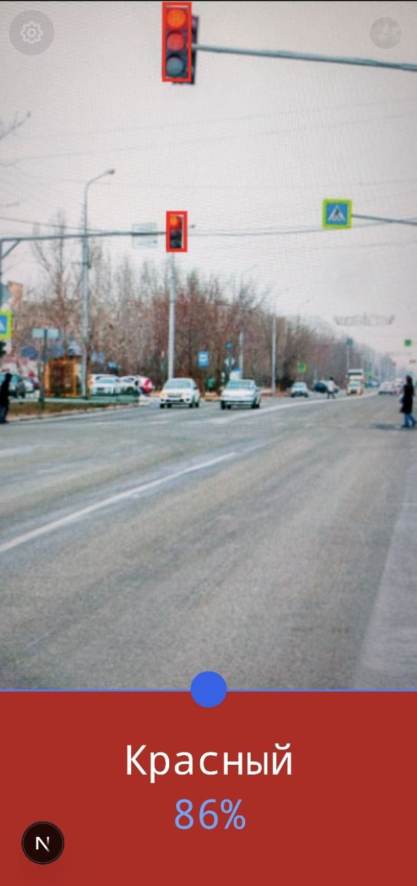
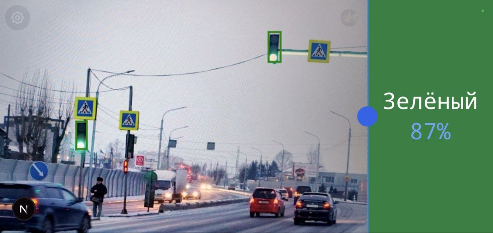

# [Chroma AI](https://chroma-ai-weld.vercel.app/)

Это приложение создано для помощи людям с дальтонизмом. С его помощью можно распознавать светофоры с использованием алгоритмов искусственного интеллекта. Приложение анализирует изображение светофора, определяет активную лампу и предоставляет пользователю информацию, необходимую для безопасного передвижения.

### Интерфейс

  
  

### Инструкции по настройке сервера

Подробные инструкции по настройке сервера уже размещены в отдельном репозитории. Пожалуйста, перейдите по следующей ссылке для ознакомления с полным руководством:

[Репозиторий с инструкциями по настройке сервера](https://github.com/IDobrinya/Chroma-Worker)
